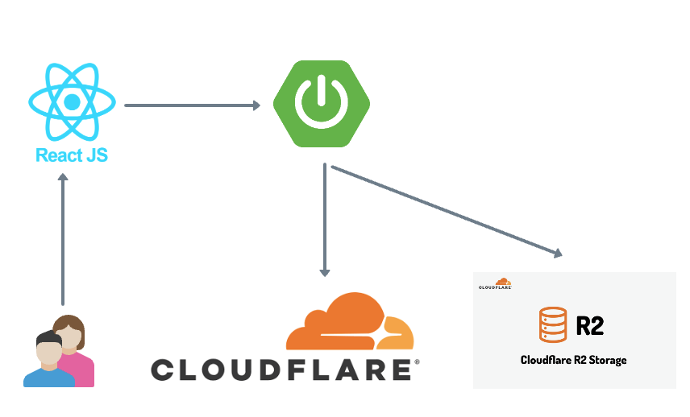
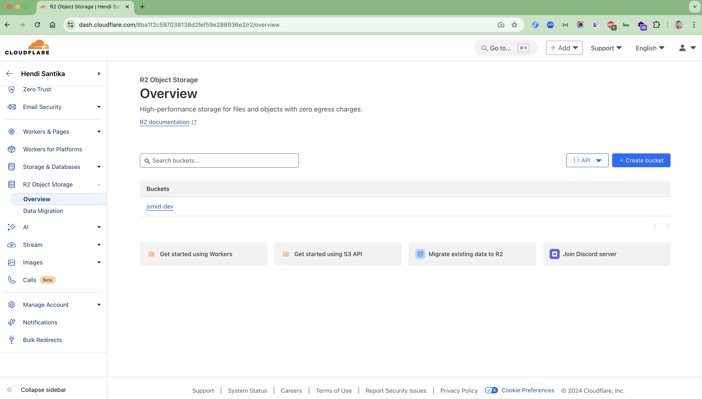
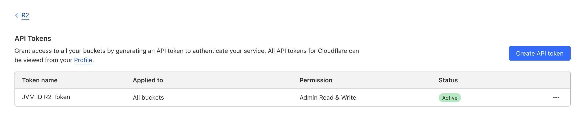

# cloudfare-r2-demo
CloudFare R2 Demo

Implementing file upload/download functionality using Spring Boot, React and Cloudflare R2

Uploading and downloading files is a huge part of what we do on the Internet. Uploading photos taken with friends or
downloading necessary programs is happening constantly right now. In order for us to download files, the files must be
stored in object storage on the Internet.
In this post, we will learn about object storage and actually configure front-end and back-end applications to actually
upload and download files.

### Object storage

Google Cloud defines object storage as follows:
> Object storage is a data storage architecture for storing unstructured data, splitting the data into multiple units (
> objects)
> and storing them in a structurally flat data environment. Each object contains data, metadata, and a unique identifier
> that can be used by applications for easy access and
> retrieval. [Additional documentation](https://cloud.google.com/learn/what-is-object-storage?hl=en)

It may seem complicated, but simply put, it means that we can store various types of files (images, videos, documents,
etc.)
that we have in an external location and access them anytime, anywhere. Google Drive, Dropbox, Naver My Box, etc.,
which are already widely used, can also be seen as examples of object storage. However, in order for application
developers to utilize object storage,
metadata that can identify each file or a protocol that can be accessed via HTTP(S) must be supported. In this case, the
object storage service provided by major CSPs is generally used, and representative products are as follows.

1. AWS Simple Storage Service (AWS3)
2. Azure Blob Storage
3. Google Cloud Storage

Services like the above not only deliver large amounts of data reliably, but also have various security technologies
applied to prevent data from leaking out. In addition, they also have a backup function to prevent data loss. However,
since the cost is determined based on capacity and traffic, you can spend a lot of money depending on the service scale,
file usage method, and file size.

### CDN

All resources used on the Internet are physically stored on a server and downloaded. We are accustomed to using them
wirelessly, but in fact, the Internet is a world built on a huge network of computers connected by cables. If you access
the Submarine Cable Map , which shows you at a glance the submarine cables that cross the world , you will be surprised
at how many cables connect the entire world.
Let's assume one situation. In order to access a service or resource hosted in the United States from Korea, a request
and response are exchanged along the cable. However, because the distance is so far, there is bound to be a delay (
latency) in loading the resource. However, hosting a service in every region of the world is not only astronomical, but
also very difficult to manage. In this case, if you utilize a CDN, you can deliver data at a reasonable cost while
improving speed and stability.
A common way to configure a CDN is to have a network edge in each region and cache the original data. Instead of having
to go to a distant server, the user can receive the data requested from the nearest network edge. CDNs have played a
significant role in enabling us to stream ultra-high definition videos without interruption or buffering.

### Cloudflare

Cloudflare is a cloud-specialized company that provides DDoS defense solutions, CDN (Content Delivery Network), DNS, and
object storage. In particular, CDN can be said to be Cloudflare's core service, and its importance is growing as
large-scale media streaming services such as OTT and SNS are gaining popularity worldwide.

### R2

R2 is an object storage service provided by Cloudflare. As of April 2, 2024, it provides 10 GB of storage space per
month for free, and its biggest advantage is that you can use AWS S3's SDK as is. In addition, it provides integrated
Cloudflare's Global DNS, so you can get data from the network edge closest to the user without any separate settings. In
the following exercises, we will configure a simple file upload/download application with Spring Boot, React, and R2.

CloudFare R2 Architecture

### Version information

* Backend
    * JDK v21
    * Spring Boot 3.4.0
* Frontend
    * Node.js v20
    * React v19.0.2
* Preparation
    * Devices with JDK 17 or later installed
    * Devices with Node.js version 18 installed
    * GitHub account
    * Cloud type account
    * Cloudflare Account
* GitHub Repository
  The hands-on training will be done using the Spring Boot, React application in the repository below. Please clone or
  fork the repository.

https://github.com/hendisantika/cloudfare-r2-demo

### Follow along

Generate Cloudflare R2 API Token

1. After logging in to Cloudflare, go to the R2 dashboard. Then, click the R2 API Token Management button under your
   Account ID in the upper right corner.

2. Click the Generate API Token button in the upper right corner.

3. Name the token freely as you like and select Administrator Read and Write for the permissions. Select the desired
   token activation period for TTL and press the Generate API Token button.
4. Once token generation is complete, the account information and endpoint required for client use are displayed. In
   this exercise, the S3 client access information and endpoint are used. If you leave the page, the authentication
   information cannot be retrieved again, so store the values ​​in a safe place. The correspondence with AWS S3 is as
   follows.
   Access Key ID => AWS Access Key ID
   Secret Access Key => AWS Secret Key
   Endpoint => AWS S3 Endpoint URL

### Create a Cloudflare R2 API Bucket

1. Return to the R2 page in your dashboard and click the Create Bucket button.
2. Enter an appropriate bucket name and the location will be automatically selected. Then press the Create Bucket
   button.
3. After bucket creation is complete, you can check the information by accessing the Settings tab as follows. The APAC
   displayed in the Location field is used as the Region value in the S3 client.
